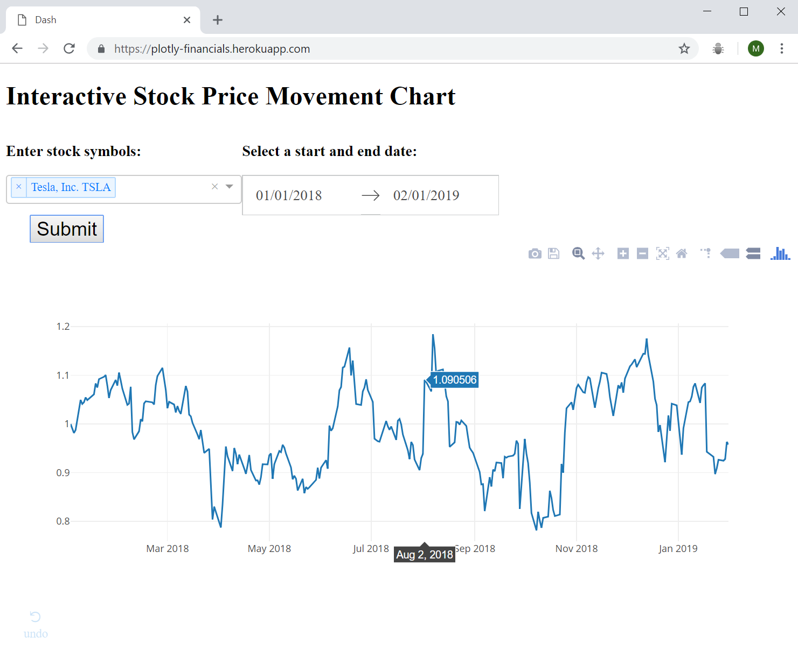
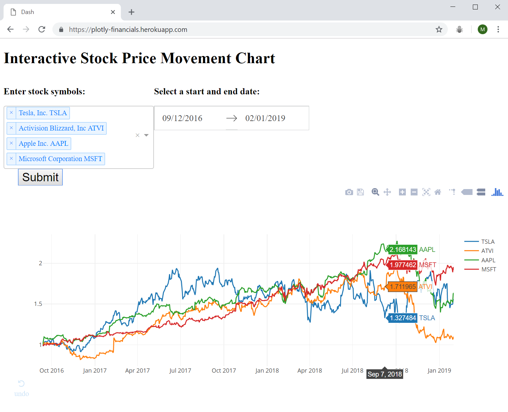

# Interactive stock price chart built with python, plotly and dash
## Interactive chart here: [https://plotly-financials.herokuapp.com/](https://plotly-financials.herokuapp.com/)
### Follow along project from an [online course](https://www.udemy.com/interactive-python-dashboards-with-plotly-and-dash/)

#### Python programming concepts used:
- Extensive use of external python libraries to streamline the chart development process.
- Use of decorators to link interactive functions with the main chart.
- Extensive use of dictionaries as input parameters into functions, to assign layout attributes and link user inputs to the main chart.
- Use of a virtual environment to isolate dependencies and enable easy deployment onto a Heroku server.

#### Main extenral libraries used in this project:
- plotly
- dash
- numpy
- pandas
- dash-core-components
- dash-html-components
- gunicorn

